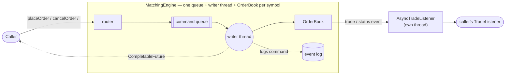

# Order Matching Engine

A price-time priority order matching engine for a single exchange, built in Java to demonstrate
core Java, object-oriented design, and concurrency skills. It accepts orders (limit, market, and
stop/stop-limit), matches them against a resting order book by price then arrival time, and
reports every resulting trade and status change to whoever is listening — single-threaded and
in-process at its core, wrapped in a multithreaded engine that runs one symbol's matching
independently of every other symbol's. Code quality, clean design, and test coverage are the
priority here, not raw throughput; the [Benchmarks](#benchmarks) section measures the throughput
and latency that design actually delivers rather than assuming it.

167 tests, 97% instruction / 94% branch coverage. See [Design Decisions](#design-decisions) for
the *why* behind the choices below, and [What Is Not Built](#what-is-not-built) for the
deliberate edges of the project's scope.

## Architecture



A caller never touches an `OrderBook` directly. `MatchingEngine` routes each command to the
queue for its order's symbol; that symbol's own writer thread — and only that thread — drains
the queue, mutates the `OrderBook`, optionally appends the command to an event log, and completes
a `CompletableFuture` back to the caller. Trade and status events go out through a listener
wrapper that runs on its own thread, so a slow listener can never stall matching. Every symbol
gets this whole pipeline to itself: `AAPL` and `MSFT` match concurrently on independent threads
with no shared mutable state between them. See [Concurrency Design](#concurrency-design-phase-4)
for the full reasoning and the races this design had to close.

## Tech Stack

- Java 21
- Maven (multi-module)
- JUnit 5 and AssertJ for testing
- JaCoCo for coverage reporting
- JMH for benchmarking

## Modules

- `engine-core` — the matching engine itself: domain model, order book, matching logic, the
  multithreaded engine, and the event log. Pure Java with zero runtime dependencies; JUnit 5
  and AssertJ are test-only dependencies.
- `engine-bench` — JMH benchmarks for `OrderBook` and `MatchingEngine`. See
  [Benchmarks](#benchmarks) below for how to run them and the last measured numbers.

## Building, Testing, and Running the Demo

```bash
mvn verify
```

This compiles all modules, runs the test suite, and generates a JaCoCo coverage report at
`engine-core/target/site/jacoco/index.html`.

To see the engine work without writing any code, run the narrated demo — it places a realistic
sequence of orders on one symbol (resting orders on both sides, a partial fill, a market order, a
stop that gets triggered) and prints every trade, status change, and the final book state:

```bash
mvn -pl engine-core compile exec:java -Dexec.mainClass=com.ayoitshasya.matching.core.demo.MatchingEngineDemo
```

`MatchingEngineDemo`'s own Javadoc walks through exactly what it submits and why, if you want to
follow along in the source rather than just the output.

## Design Decisions

### Prices and quantities are `long` ticks, not `double` or `BigDecimal`

Prices and quantities are represented internally as `long` values in ticks, where 1 tick =
0.01 (one paisa). Conversion to and from a human-readable decimal representation
(`BigDecimal`) happens only at the API boundary — never on the matching path.

- **Why not `double`?** Binary floating point cannot exactly represent most decimal
  fractions (0.1, for instance, has no exact binary representation). Repeated arithmetic
  during matching — adding, subtracting, and comparing prices across thousands of orders —
  accumulates rounding error, which is unacceptable when the numbers represent money.
- **Why not `BigDecimal`?** `BigDecimal` is exact and would avoid the rounding problem, but
  it is an immutable object with real allocation and comparison overhead. On a hot path that
  may process orders at high throughput with tight latency requirements, boxing every price
  and quantity into a `BigDecimal` and allocating a new instance on every arithmetic
  operation is costly.
- **Why `long` ticks?** Integer arithmetic is exact (no rounding error) and as fast as
  arithmetic gets on the JVM — no allocation, no boxing. Scaling by a fixed number of ticks
  (here, 100 ticks per currency unit) turns "0.01 increments of currency" into ordinary
  integer addition, subtraction, and comparison. The tradeoff is that every value crossing
  the system boundary (a REST request, a database column, a log line meant for a human) must
  be explicitly converted between ticks and `BigDecimal`, which is a small, well-contained
  cost paid once per request rather than once per comparison.

### Sequence numbers instead of wall-clock timestamps

Each order and trade carries a `sequence` value — a monotonically increasing number assigned
by the engine at intake — rather than a wall-clock timestamp. Price-time priority depends on
being able to strictly order two orders placed at the same price. Wall-clock timestamps are
subject to clock resolution limits, NTP adjustments, and (once the engine is multithreaded)
reordering across threads, any of which could make two distinct orders appear to arrive at
the same instant, or appear out of order relative to when they were actually accepted. A
sequence number generated by a single authority at intake has none of these problems and
gives deterministic, reproducible ordering — which also makes the event log replayable later.

### Abstract `Order`, not a single concrete class with a type flag

`Order` is an abstract class holding only what every order type has in common (identity,
symbol, side, quantity, sequence, status). Order-type-specific data, such as a limit price,
lives on the concrete subclass (`LimitOrder`). This kept the base class stable when market and
stop orders were added later: they are new subclasses, not new fields and branches bolted onto
an existing class or a growing `switch` on a type enum.

### Encapsulated state transitions

`Order` fields are private and there are no public setters. Status changes only happen
through `fill(long)`, `cancel()`, and `reject()`, each of which validates the requested
transition (a filled order cannot be cancelled, a fill cannot exceed the remaining quantity,
and so on) and throws `InvalidOrderException` with a clear message otherwise. This makes
invalid states unrepresentable through the public API rather than merely discouraged by
convention.

### Polymorphic matching: no `instanceof`, no `switch` on order type

`OrderBook.submit` accepts a `TradableOrder` — an abstract layer between `Order` and the
concrete `LimitOrder`/`MarketOrder` types — and never asks what concrete type it was given.
Two abstract methods carry all of the type-specific behavior:

- `crosses(long oppositePrice)` — whether this order can trade against a given opposite best
  price. A limit order compares its own price; a market order always returns `true`.
- `applyUnfilledRemainder(UnfilledRemainderHandler)` — what happens to whatever is left after
  matching stops. This is a double dispatch, not a type check: `LimitOrder` calls
  `handler.rest(this)`, and `MarketOrder` calls `handler.cancelRemainder(this)`. Because
  `rest` is typed to accept only a `LimitOrder`, the compiler — not a runtime check —
  guarantees that only a resting-capable order can ever enter a price level or the
  cancellation index. `MarketOrder`'s class name does not appear anywhere in `OrderBook`.

Adding a new tradable order type later means implementing these two methods on a new
`TradableOrder` subclass; `OrderBook` does not change.

### `StopOrder` lives outside the matching hierarchy entirely

A stop order is never matched directly, so it does not extend `TradableOrder` — it has no
crossing rule and no unfilled remainder, because it is never submitted to the matching loop
in the first place. It waits in a separate pending stop book (a `TreeMap<Long, PriceLevel<StopOrder>>`
per side, reusing the same generic `PriceLevel` that backs the visible book, since "orders
waiting at a price, in arrival order" is the same shape either way).

A buy stop triggers when the last trade price rises to or above its stop price; a sell stop
when it falls to or below. Once triggered, it produces (`StopOrder.trigger`) the order that
actually enters the book: a `MarketOrder` for a plain stop, or a `LimitOrder` at its limit
price for a stop-limit — carrying the same order ID forward, since it's a continuation of the
same order's lifecycle, not a new one.

**Cascades.** Triggering a stop can produce a trade, which can trigger another stop, which can
produce another trade. `OrderBook.processTriggeredStops()` handles this with a loop, not
recursion: after any order's own matching finishes, it repeatedly polls "is there a pending
stop the current last trade price would trigger?", processes it, and polls again, until
nothing triggers. A cascade of any length is handled by iteration.

This checks for triggers once per top-level `submit`, after that order's matching has fully
run — not after every individual trade inside a multi-level sweep. A stop that would have
triggered partway through a large sweep still triggers, just once the sweep (or the cascade
step that produced it) finishes rather than interleaved mid-sweep. Real venues interleave more
tightly; this is a deliberate simplification, made because fully interleaved triggering adds
real complexity for a case (a stop firing mid-sweep of a single aggressive order) that doesn't
change the eventual outcome, only its timing within one already-atomic operation.

Cascaded trades are delivered to `TradeListener`s but are not included in the `List<Trade>`
that the original `submit` call returns — the caller asked to place one order, not to receive
every downstream consequence of doing so. Listeners are the mechanism for observing everything
that happens, direct or cascaded; the return value is just a receipt for the one order.

### Observer pattern for trades and status changes, with listener isolation

`OrderBook` notifies registered `TradeListener`s of every trade and every order status
transition. A listener is an observer, not a participant in matching: `OrderBook` catches
`RuntimeException` around each individual listener call, so a broken market-data feed or
metrics hook can neither corrupt a trade nor prevent other listeners from being notified nor
abort matching itself. The alternative — letting a listener exception propagate — would mean
a bug in, say, a WebSocket broadcaster could leave an order half-matched and the book in an
inconsistent state, which is a far worse outcome than that one listener silently missing an
update.

## Concurrency Design (Phase 4)

`MatchingEngine` is the multithreaded entry point: one `OrderBook` per symbol, each owned by
exactly one writer thread, so `OrderBook` itself never needs a lock (see above — it stays
built for a single mutator, as originally designed).

### One writer thread per symbol, fed by a queue

Each symbol gets a `SymbolWorker`: an `OrderBook`, a `BlockingQueue` of commands, and a single
dedicated thread that takes commands off that queue and runs them against the book, one at a
time, in arrival order. Because exactly one thread ever touches a given symbol's book, there
is nothing to lock there — the concurrency safety of the whole engine reduces to "does a
command ever reach the wrong book, or reach the right book more than once, or get lost." Two
symbols are entirely independent: `AAPL` and `MSFT` match concurrently on two different
threads with no shared mutable state between them at all.

### Commands and futures, not direct method calls

A caller never touches an `OrderBook`. `MatchingEngine` exposes `placeOrder`,
`placeStopOrder`, `cancelOrder`, and `cancelStopOrder`, each of which builds a `Command`
(a sealed interface of four records: `PlaceOrder`, `PlaceStopOrder`, `CancelOrder`,
`CancelStopOrder`), hands it to the owning symbol's worker, and returns a
`CompletableFuture` that the writer thread completes once it has actually run that command —
normally with the result, exceptionally if the command threw. A command throwing
(`InvalidOrderException`, `OrderNotFoundException`) never kills its writer thread: only that
one command's future is affected, and the thread loops back for its next command. See
NOTES-CONCURRENCY.md for why this matters and how it is guaranteed.

### Listener notifications are decoupled from the writer thread

`OrderBook` still calls its listeners synchronously and inline with matching, by design (see
above). But a listener that runs slowly would stall whichever writer thread called it,
backing up that entire symbol's queue behind one slow observer. `MatchingEngine` never gives
a raw listener to an `OrderBook`; it wraps every listener in an `AsyncTradeListener`, backed
by its own single-thread executor, so the writer thread's call to the listener only has to
enqueue a task and return. A slow or broken listener can only ever delay itself.

**Ordering guarantee.** A listener always sees one symbol's trades and status changes — direct
and cascaded alike — in the exact order that symbol's writer thread produced them: every event
for a symbol comes from that symbol's single writer thread, and a single-thread executor's FIFO
queue always preserves one caller's own submission order. There is no equivalent guarantee
*across* symbols. `MatchingEngine.addListener` registers the same listener on every symbol's
book, so a listener watching several symbols has its events enqueued by several independent,
unsynchronized writer threads with no shared clock or sequence between them — it can observe
trades from different symbols in an order that has nothing to do with when they were actually
matched. (`Trade.sequence` cannot rescue this either: it is assigned per `OrderBook`, so it only
orders trades within one symbol, not across them.)

### Graceful shutdown

`MatchingEngine.shutdown()` stops accepting new commands, lets every symbol's queue drain to
whatever was already in it, joins every writer thread, then closes every listener's executor.
A command submitted after shutdown has started fails its future immediately with
`EngineShutdownException` rather than hanging — there is no window where a command is
accepted but never actually run. See NOTES-CONCURRENCY.md for the races this had to close to
be true.

## Event Log and Replay (Phase 5)

`MatchingEngine` can optionally be given an `EventLogWriter`, which appends every accepted
command to a line-based log file. `EventLogReplayer` reads that file back and resubmits every
command to a fresh `MatchingEngine` through its normal public API — replay is not a separate
code path from live matching, it is the same matching logic driven by a file instead of a live
caller.

### A hand-rolled line format, not a serialization library

`engine-core` carries zero runtime dependencies (see above), and the command vocabulary is small
and fixed — four `Command` types, one of which is either a limit or a market order, another of
which is either a plain stop or a stop-limit. `EventLogCodec` encodes each as one pipe-delimited
line (`PLACE_LIMIT|AAPL|1|BUY|10|150|7`, and five more shapes for the rest) rather than pulling in
a JSON or protobuf library to serialize six fixed shapes.

### Logging happens on the writer thread, but never blocks it

A command is logged from inside its symbol's own writer thread, at the moment that thread
dequeues it to process it — the same single-writer-per-symbol property that keeps `OrderBook`
lock-free (see above) also means the log for one symbol is written in exactly the order that
symbol's commands were actually processed, with no extra synchronization needed to guarantee it.

Logging itself, though, must not put disk I/O on the matching hot path. `EventLogWriter` only
builds the line (cheap) on the caller's thread; the actual write happens on its own dedicated
single-thread executor, the same decoupling `AsyncTradeListener` uses for listeners and for the
same reason — a writer thread that had to wait on disk for every command would have its
throughput bounded by disk latency instead of by matching logic.

This is a durability tradeoff, not a free lunch: `append` returns before the line reaches disk,
so a crash can lose whatever lines were still sitting in the log's own executor queue at that
instant. Every line is still flushed individually as soon as it is written, so a crash can only
ever cost the lines not yet handed to the OS, not anything already written — and note `flush()`
pushes bytes out of this process's buffers, but does not `fsync`, so an OS crash or power loss
between that flush and the OS persisting the page to physical disk is a gap this project accepts
in exchange for keeping any disk-durability cost off the matching path entirely.

### A truncated or corrupt final log line

A crash mid-write is the realistic failure case for this log, and it can only ever corrupt or
truncate the one line that was being written at the moment of the crash — every earlier line was
already flushed in full. `EventLogReplayer` uses exactly that fact: if the *last* line in the
file fails to decode, it is discarded with a warning and everything before it replays normally;
if any line *other than the last* fails to decode, that is not the expected failure mode (a clean
crash cannot corrupt a line and then keep writing valid ones after it), so replay fails loudly
with `EventLogCorruptionException` instead of silently skipping or guessing at a log that may be
corrupt for a reason worth investigating.

### Queries are a separate, unlogged path

`MatchingEngine.restingOrders`, `pendingStops`, and `lastTradePrice` (used by the replay test to
compare a rebuilt book against the original) run a read-only function against a symbol's book on
that symbol's own writer thread, so a query can never race a concurrent mutation. They are
deliberately not `Command`s and are never written to the event log: a query does not change
state, so there is nothing to replay, and logging one would only grow the file for no benefit.
`MatchingEngine` still never exposes `OrderBook` itself to a caller — these methods return plain,
immutable snapshots (`RestingOrderView`, `PendingStopView`).

## Benchmarks

`engine-bench` holds JMH benchmarks for both `OrderBook` (single-threaded, no queueing) and
`MatchingEngine` (multithreaded, the full command/future/writer-thread machinery). The two are
deliberately kept separate rather than compared as if they measured the same thing — see
[Why the two throughput numbers aren't directly comparable](#why-the-two-throughput-numbers-arent-directly-comparable)
below.

### Running them

```bash
mvn -pl engine-bench package
java -jar engine-bench/target/benchmarks.jar
```

`mvn package` (or `verify`) builds `engine-bench/target/benchmarks.jar`, a self-contained jar
with JMH bundled in via the shade plugin — the standard way to run JMH under Maven. Pass a class
name to run just one benchmark, e.g. `java -jar benchmarks.jar OrderBookThroughputBenchmark`.

### Configuration

Every benchmark uses the same JMH settings, set in code via annotations rather than the command
line, so `java -jar benchmarks.jar` alone reproduces the numbers below:

- 3 warmup iterations, 1 second each
- 5 measurement iterations, 1 second each
- 1 JVM fork
- Throughput benchmarks report ops/s (`Mode.Throughput`); latency benchmarks report percentiles
  in nanoseconds (`Mode.SampleTime`), which JMH computes natively for that mode
- `MatchingEngineThroughputBenchmark` runs 4 JMH threads, one per symbol, so no two threads ever
  contend for the same symbol's queue; every other benchmark runs single-threaded

This is a deliberately quick configuration (JMH's own defaults recommend far more iterations and
forks for publication-quality numbers) chosen to keep a full run under two and a half minutes for
a portfolio project, at the cost of wider confidence intervals than a rigorous capacity-planning
exercise would use — visible in the error margins below, and called out explicitly rather than
hidden.

### Machine

- CPU: Intel Core i5-1135G7 (11th Gen), 4 physical cores / 8 logical processors, 2.40 GHz base
- RAM: 16 GB
- OS: Windows 11
- JDK: OpenJDK 21.0.12.1 (Microsoft build), 64-bit Server VM
- JMH: 1.37

### Results (last measured 2026-09-15)

**Throughput**

| Benchmark | Threads | Result |
|---|---|---|
| `OrderBookThroughputBenchmark.restNonCrossingLimitOrder` | 1 | 838,666 ± 651,886 ops/s |
| `MatchingEngineThroughputBenchmark.placeNonCrossingLimitOrder` | 4 (one per symbol) | 193,252 ± 32,341 ops/s |

**Latency percentiles, ns/op** (`p50` / `p99` / `p99.9`)

| Benchmark | depth=10 | depth=100 | depth=1000 |
|---|---|---|---|
| `OrderBookRestLatencyBenchmark` (rest a non-crossing order) | 400 / 3,300 / 36,160 | 500 / 2,700 / 48,475 | 400 / 2,200 / 28,412 |
| `OrderBookMatchLatencyBenchmark` (sweep `depth` resting orders) | 600 / 2,100 / 20,288 | 3,600 / 20,480 / 172,343 | 56,640 / 184,576 / 498,999 |
| `MatchingEngineLatencyBenchmark` (round trip, rest a non-crossing order) | 10,992 / 53,248 / 169,003 | 18,176 / 58,880 / 239,059 | 11,392 / 49,152 / 159,748 |

Full output, including every percentile JMH reports (down to p99.99) and the raw histograms, is
in `engine-bench/target/benchmark-output.log` after a run.

### Reading these numbers

**Resting an order barely scales with the number of price levels already in the book, in this
range.** `OrderBookRestLatencyBenchmark`'s p50 sits at 400–500 ns whether the opposite side
already has 10 or 1,000 distinct price levels. `TreeMap` navigation is O(log n) — at n=1,000
that's about ten comparisons, small enough next to fixed per-call overhead and JIT/safepoint
noise to not show up as a trend at these depths. A book with vastly more price levels (or a
non-trivial `Comparator`) would be a different story; this one isn't at this range.

**Matching a queue of resting orders scales with queue length, as expected.** Unlike resting,
`OrderBookMatchLatencyBenchmark` walks and fills every order it sweeps — p50 latency grows
roughly 100x from depth 10 to depth 1,000 (600 ns → 56,640 ns), consistent with the FIFO
iteration and per-fill trade bookkeeping in `OrderBook.match()` being genuinely O(depth) work,
not O(log depth) like a price-level lookup.

**`MatchingEngine`'s round-trip latency is dominated by cross-thread handoff, not the book.**
`MatchingEngineLatencyBenchmark` (the same non-crossing rest operation as
`OrderBookRestLatencyBenchmark`, just through `placeOrder(...).get()`) sits at roughly
11,000–18,000 ns at p50 — 25–40x `OrderBook`'s own 400–500 ns — and is essentially flat across
depth, exactly like the operation it wraps. That flat ~10–20 microsecond gap is the queue
handoff plus the caller thread parking and being woken by the writer thread once the future
completes: a fixed per-call cost of the concurrency design, not something that grows with book
size.

#### Why the two throughput numbers aren't directly comparable

`OrderBookThroughputBenchmark` (838,666 ops/s) measures pure single-threaded matching-logic
throughput: no queue, no future, no second thread involved at all.
`MatchingEngineThroughputBenchmark` (193,252 ops/s, on 4 threads) looks like it should be higher,
not roughly a quarter of it — until the benchmark is read carefully: each of its 4 threads calls
`.get()` and blocks after every single order, so its throughput is bounded by
*(threads) / (round-trip latency)*, not by how fast a writer thread can drain its queue. At the
~15 microsecond round-trip latency `MatchingEngineLatencyBenchmark` measured, 4 threads blocking
serially on that latency caps out at roughly 4 / 15µs ≈ 260,000 ops/s — in the right ballpark for
the 193,252 actually observed. A producer that pipelined requests instead of waiting for each one
individually would be bounded by the writer thread's own drain rate instead, which — since
draining a queue is nearly as cheap as calling `OrderBook.submit` directly — would sit much
closer to `OrderBookThroughputBenchmark`'s number, multiplied across however many symbols are
trading concurrently. These two benchmarks answer different questions (peak single-thread
matching speed vs. realistic blocking-caller round-trip throughput) and neither is a ceiling or a
floor for the other.

### Hot-Path Optimization Attempt

**The candidate.** `OrderBook.match()` used to start with `List<Trade> trades = new ArrayList<>();`
unconditionally, on every single call — including the common case where the incoming order
doesn't cross anything and the list stays empty for the call's entire lifetime, only to be
returned and discarded. The change: start `trades` as `List.of()` (a shared, genuinely
zero-allocation empty instance — not a fresh empty `ArrayList`, which the JDK already makes cheap
but not free) and only swap in a real, mutable `ArrayList` lazily, the first time a trade actually
occurs:

```java
List<Trade> trades = List.of();
...
    if (trades.isEmpty()) {
        trades = new ArrayList<>();
    }
    trades.add(trade);
```

This cannot make a non-crossing submission — the majority case in a healthy two-sided book —
allocate anything at all for its trade list, where it previously always allocated one (small)
`ArrayList` object. A crossing order still allocates exactly the one `ArrayList` it always did,
the first time it needs it.

**Measurement.** `OrderBookThroughputBenchmark.restNonCrossingLimitOrder` — 100% non-crossing
inserts, so it exercises exactly the path being optimized — was run before and after with a
tighter configuration than the main results above (3 forks × (5 warmup + 5 measurement)
iterations, to shrink the confidence interval enough to judge a change this small):

| | Score | 99.9% CI |
|---|---|---|
| Before | 860,202 ± 208,513 ops/s | [651,689 – 1,068,715] |
| After | 969,104 ± 153,815 ops/s | [815,289 – 1,122,919] |

The point estimate moved up about 12.7%, but the two confidence intervals overlap substantially
(roughly 815,000–1,069,000 is common ground to both) — this single comparison does not clear the
bar for a statistically convincing win on its own; the honest read is "directionally positive,
not conclusively proven" at this sample size, on a laptop rather than a quiet dedicated
benchmarking host. JMH's own reminder about not over-trusting noisy numbers is the right caution
to apply here rather than round the result up to a bigger claim than it supports.

**Kept anyway, and why.** The change stayed in. Unlike an optimization whose benefit rests
entirely on a benchmark being read correctly, this one is provably strictly less work in the
non-crossing case — zero allocations where there used to be one — by inspection of what `List.of()`
versus `new ArrayList<>()` actually do, independent of what any single noisy timing run shows.
There is no code path this change makes slower: a crossing order allocates exactly as much as it
did before, and every one of the 166 existing tests (unchanged behavior, `List<Trade>` is still
the return type) still passes. Given a change that is mechanically an allocation reduction with
no downside and no added complexity worth worrying about, keeping it does not require the
throughput benchmark to have proven a large win — only that it didn't show a loss, which it
didn't.

## What Is Not Built

Everything below is a deliberate scope boundary, not a gap left by running out of time — each
one was cut to keep the project focused on core Java, OOP, and concurrency design, which is what
it set out to demonstrate.

- **No REST, WebSocket, or any network API.** The engine is a Java library, driven by direct
  calls to `MatchingEngine`'s public methods — see the [Demo](#building-testing-and-running-the-demo)
  for exactly what that looks like. Exposing it over HTTP is a separate concern (a web framework,
  request/response mapping, an API contract to version) layered on top of, not mixed into, the
  matching logic itself.
- **No database or persistent storage.** Book state lives in memory only. The event log (see
  [Event Log and Replay](#event-log-and-replay-phase-5)) is an append-only replay mechanism for
  rebuilding that in-memory state, not a queryable store — there is no schema, no indexing, no
  querying trades by anything other than replaying the whole log in order.
- **No authentication, authorization, or multi-tenant isolation.** Any caller with a Java
  reference to a `MatchingEngine` can place or cancel any order on any symbol. There is no
  concept of an account or a user the engine is aware of.
- **No risk checks.** Orders are accepted on structural validity alone (positive price and
  quantity, a real order ID) — never against an account balance, a position limit, or any other
  business rule. A real exchange's pre-trade risk checks are a distinct responsibility from
  matching and were kept out to keep that boundary clean.
- **No order types beyond limit, market, stop, and stop-limit.** No iceberg orders, no
  time-in-force beyond a limit order resting until filled or cancelled (no IOC, FOK, or GTD), no
  self-trade prevention.
- **Single process, no clustering.** `MatchingEngine`'s per-symbol parallelism is threads within
  one JVM, not processes or machines — no sharding a symbol's book across nodes, no leader
  election, no distributed consensus. A real exchange operating at a scale where one machine
  can't hold every symbol's book would need that; this one doesn't attempt it.
- **No containerization or CI/CD pipeline.** No Dockerfile, no Kubernetes manifests, no GitHub
  Actions workflow. `mvn verify` is the entire build and test story, run locally.
